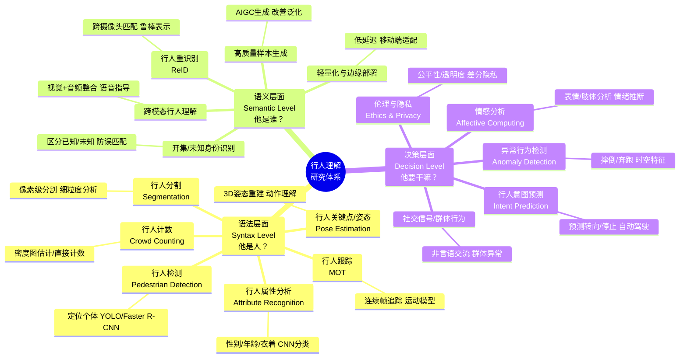

# 一个小目标 （2026/5/9）

**郑哲东**

> “科研不是一场短跑，而是一场有方向的马拉松。”

---

## 一、如果你感到迷茫或缺乏勇气：先看这一篇

🔗 **推荐阅读**：[熊辉教授：为什么人前进的路总是被自己挡住](https://lite.evernote.com/note/3de79ff0-5778-417c-9bcb-6c0111a26694)

很多博士生初期都会经历自我怀疑：“我能做出东西吗？”、“我的方向有意义吗？”、“别人比我强太多了”。

熊辉教授这篇文章提醒我们：**阻碍我们前进的，往往不是能力不足，而是内心的恐惧与自我设限。**

→ 建议你在每个低谷期都回头读一遍，提醒自己：**迈出第一步，比完美计划更重要。**

---

## 二、如何选择研究方向？三个层次的战略思考

作为博士生，你的研究方向不仅决定短期产出，更影响长期发展。可以从以下三个层次来思考：

### ✅ 层次1：构建“科研生态”——做“造雨者”，而非只是“找伞人”

**目标**：创造一个能让很多人持续发论文的新领域或新平台

*   **基础做法：在现有数据集上刷点（SOTA）**
    *   快速出成果的方式，适合起步阶段
    *   但需警惕：只是“在边界内做得更好”，而非“拓展边界”
    *   → 问自己：我是终结这个数据集的人吗？还是只是路过？
*   **进阶做法：构建通用平台 / 新设定（setting）**
    *   比如：支持多天气、多遮挡、跨模态、跨域等更贴近现实的场景
    *   让别人在这个平台上“刷性能”，你掌握核心设计权
    *   → 你成了“平台搭建者”
*   **最高级做法：提出新任务 + 构建新数据集**
    *   示例：我提出的 PAB（文本驱动行人异常搜索）、University-1652（无人机地理定位）
    *   这类工作一旦被认可，会形成“论文闭环”：别人用你的数据集刷点，你也持续改进它。
    *   → 你成了这个方向的“定义者”。

📌 **建议**：低年级可先从“刷点”练手，但要逐步向“造数据/造任务”过渡，争取在博士中期完成一次“生态级”贡献。

### ✅ 层次2：打造个人学术标签——让人“想到领域就想到你”

**目标**：建立清晰的学术身份（academic identity）

*   **理想状态**：
    *   别人一想到“行人重识别（reID）”，就想到你；
    *   或一提到“无人机地理定位”，就觉得你是专家。
*   **如何实现？**
    *   在一个方向上持续深耕 3–4 篇高质量论文
    *   主动构建系列工作（如：数据集 → 方法 → 应用 → 综述）
    *   参与组织 workshop、tutorial、开源项目（参考我主页的 Resources 页面）
*   **⚠️ 警惕频繁换方向**：
    *   每换一次方向，相当于“重启职业生涯”
    *   学术圈记住的是“标签”，不是“泛泛之辈”

📌 **建议**：博士前两年尽量聚焦 1–2 个核心方向，形成“作品集思维”，而不是“论文数量思维”。

### ✅ 层次3：掌握顶会顶刊的方法论——学会“看懂游戏规则”

**目标**：从“被动读论文”到“预判论文能否中稿”

发表不是靠运气，而是可学习的技能。建议三步走：

1.  **大量阅读（输入）**
    *   精读近3年顶会（CVPR/ICCV/ECCV/ACM MM/NeurIPS等）相关方向论文
    *   关注：动机、创新点、实验设计、写作结构
2.  **批判性分析（判断）**
    *   读完一篇论文后问自己：这个工作为什么能中？
    *   如果我是审稿人，我会提什么意见？
    *   它是“增量改进”还是“范式改变”？
3.  **模仿与超越（输出）**
    *   初期可以“仿照”高分论文的结构写自己的工作
    *   逐步加入自己的独特视角，形成风格

📌 **建议**：建立一个“顶会论文拆解笔记”，记录每篇好论文的“得分点”，形成自己的“中稿公式”。

---

> 你的博士生涯，是一次“从执行者到定义者”的跃迁。
> **“不要只做别人设定好的题，试着去出一道让别人想做的题。”**

**构建生态系的例子：**

### 🧠 请尝试进行类似思考：

1. **Uncertainty 生态系**：检测 uncertainty / 利用 uncertainty 优化训练 / uncertainty 高的时候，自主导入外部 tool、RAG / 结合 AIGC 做通用模型。
2. **无人机生态系**：无人机物体检测 → 反无人机监测 / 无人机视觉定位 / 无人机导航 / 无人机 Embodied AI。从虚拟人 / 机器人 / 多无人机协同 / 智慧城市等未来十年的技术角度去思考：他们缺乏什么感知 / 推理能力？
3. **可行性边界**：什么能做？什么不能做？充分考虑硬件限制与数据限制。

---

### 📐 常用论文套路（基于 `neXt` 六边形模型）

#### 🔹 `Xd`：升维打击（把 2D 的方法引入 3D/视频等更复杂、更多信息的模态）
1. `2D Image` → `3D Mesh`
2. `Single Image` → `Video Clips`
3. `Prior Knowledge` (Unsupervised Parsing / Scene Graph) → `XXX tasks`

#### 🔹 `X+Y`：跨界融合（把差异很大的两个方法/任务融合，切记不能简单串行！）
1. `Test-time Adaptation` + `Uncertainty` (Test data uncertainty to update Model)
2. `ReID` → `Tracking` (A Unified System) → `Cross-modality ReID`
3. `Dataset Distillation via Uncertainty` (选择关键难样本)
4. `Action Recognition` + `ReID` / `Attributes` / … (任务融合)

#### 🔹 `X↓`：算法升级（在原始问题上，引入更新的算法。有钉子，找锤子。）
1. **结构迭代**：（往往可作为 minor contribution）
   - `CNN` → `Transformer` / `Diffusion` / `Mamba`（稍老） → `Large Models`
   - `AutoML` → `Search one-for-all structure`（DARTS 较快，高度依赖搜索空间设计。现流行同时搜索大/小模型） → `Search MoE weights`
   - `Local attention` → `keypoint` / `part attention`（较老但 work，易被质疑创新性） → `Scene graph`
2. **结合多模态大模型**：数据增强 / Reranking 等下游适配

#### 🔹 `X↑`：问题迁移（有了核心算法，找合适的问题。有锤子，找钉子。）
1. `Uncertainty` 用于各种半监督 / 无监督问题
2. 用 `Diffusion` / `Flux` 生成数据辅助长尾问题（优化 Diffusion 或后续学习管线）
3. **Causality（因果推断）**：
   - 核心目标：处理 bias 与 disentangle，通过因果图建模。
   - 示例：“训练数据都是狗在沙滩。怎么做到生成狗的图像背景不一定是沙滩？”
4. **物体示能（Affordance）与高层推理**：
   - 人类不是简单融合多模态信息，而是具备语义推理能力。
   - 示例：结合“汽车可喷涂为各种颜色”的高层先验知识 + “一辆红色汽车”的视觉信息，使模型能泛化识别从未见过的黑色汽车。

#### 🔹 `X++`：更高更快更强（追求效率、规模或鲁棒性）
1. **More Efficient**：Small model / Post-processing 加速
   - 解决老方法顽疾（如 Reranking 特别慢、内存/显存占用大）。
   - 典型论文：*3000FPS Face Alignment*
2. **Multi-Tasks / Multi-Datasets**：Meta Learning 框架（适配多天气 / 多数据集 / 多属性）

#### 🔹 `X̄`（X-bar）：反套路思维（打破传统范式）
1. **反思大模型局限**：传统路线依赖大模型，但它是否有固有缺陷？什么缺陷？为什么存在？能否“越狱”或设计轻量/确定性方案规避？
2. **反向检索/推理范式**：传统用 Query 搜索 Gallery，能否反过来通过 Gallery 反问（根据 Top Candidate 反向生成/筛选约束条件或问题）？

### Find X （之前的工作）

## 📊 研究任务 - 算法 - 引用对照表

### 🔹 Novel-View Data Generation / Collection

| Survey (研究任务) | Algorithm / 论文 / 备注 |
|------------------|------------------------|
| **1D Speech Generation** | Speech Transfer [27] |
| **2D Person Generation / Video Generation** | Cloth Try-on [1], Sign Language Generation [28, 29], Multi-round 2D Diffusion [36] |
| **2D Face Generation + 3D Clues** | Makeup [2], Nerf [15], Eyeglass Removal [23] |
| **2D Scene Collection** | University1652 [3] |
| **2D/3D CrossView Scene Generation (BirdView)** | Video2BEV [45] |
| **2D Vehicle Collection** | VehicleNet [4] |
| **2D Vehicle Generation + 3D Clues** | Vehicle ReID [44] |
| **2D Paint Generation** | `Linyu` → Diff Image; `Qichao` → Test-time Adaptation [47] |
| **3D Mesh Generation** | 3D Magic Mirror [25] |
| **Language Guided 2D/3D Generation** | Text-to-3D Diffusion [36]; `Yinuo` → Depth Fusion; `Bankey` → Traditional Art |
| **Video Generation** | Painting Animation [43], Sign Language Video [28] |
| **Emotional Expression Generation** | Emotional Facial Expressions [48] |
| **Hand-Object Interaction** | TIGeR [49] |

### 🔹 Multi-view Data Matching (Multi-View Understanding)

| Survey (研究任务) | Algorithm / 论文 / 备注 |
|------------------|------------------------|
| **Model Structure (CNN)** | PAN [16], Thorax [20], LPN [14], RK-Net [22], StepNet [29] |
| **Model Structure (Transformer / Mamba / LLaVA)** | `Jacky`, `Wang Hao`, Differential Query [50] |
| **AutoML** | — |
| **Occlusion Handling** | `Diego` → Loss / Uncertainty |
| **Loss Design** | Contrastive Loss [18], Instance Loss [5], Decorrelation [51] |
| **Language + Image** | GeoText [32], APTM [39], Dual-path [5] |
| **Image Retrieval with Text Feedback** | Uncertainty Embedding [31], Consistency [41], Joint Graph [52] |
| **Multi-round Retrieval** | `Hao Ju` via LLM [38, 53] |
| **3D Point Cloud / Registration** | 3D Re-ID [7], Unsupervised 3D [34, 35] |
| **Extra Annotations (Meta Info)** | Attribute [17] |
| **Re-ID + Tracking** | — |
| **Adversarial Attack** | U-Turn [24] |
| **Re-Ranking** | GPU-ReRanking [8], Learnable Pillar [54] ⚠️ 待解决显存问题 |
| **Scene Graph** | — |
| **Audio-Video Retrieval** | VimoRAG [55] |
| **Vehicle Re-ID** | VehicleNet [4], Vehicle ReID [44], Robust Vehicle [56] |
| **Depth Estimation** | Uncertainty [37], Depth-aware [57, 58] |
| **Trajectory Prediction** | `Jintao Sun` [59] |
| **Pruning** | Soft Pruning [9], WoRA [40], Progressive [60] |
| **Cross-view Geo-localization** | University-1652 [3], LPN [14], RK-Net [22], Multi-environment [26] |

### 🔹 Data Generation + Data Matching (Understanding Human/Object Deeply)

| Survey (研究任务) | Algorithm / 论文 / 备注 |
|------------------|------------------------|
| **GAN/Diffusion for Data Augmentation** | in vitro [10], DG-Net [11], CameraStyle [19], Pretraining [6], Abnormal Image/Video [46, 61]; `Shuyu Yang` → Abnormal Video Generation [46] |
| **Domain Adaptation / Pseudo Label Refinery** | Uncertainty [12], Memory Regularization [13], PiPa [30], Depth Distribution Alignment [33], Uncertainty [35], Context-aware [62] |
| **Model Ensemble / Data Selection** | Adaboost [21], 2D+3D [34] |
| **Meta Learning for Multi-Domain** | Multi-weather [26], CAMeL [42], Meta Learning [42] |
| **Uncertainty + LLM** | `Ruiyang` → Qwen [35, 63]; `Mingyang` → Medical Text LLM; VL-Uncertainty [63] |
| **Text-based Person Retrieval** | APTM [39], CAMeL [42], WoRA [40], Pretrain-then-Adapt [64], Weak Pair [65], Domain-aligned [66] |
| **Test-Time Adaptation** | `Qichao` [47], Ctrl-u [67], Pretrain-then-Adapt [64] |
| **Anomaly Detection** | UniAD [68], Beyond Walking [46], AnomalyLMM [69] |
| **UAV/Drone Applications** | UAVReason [70], WeatherPrompt [71], Video2BEV [45] |

---

## 📚 References

[1] Bingwen Hu, Ping Liu, Zhedong Zheng, Mingwu Ren. SPG-VTON: Semantic Prediction Guidance for Multi-pose Virtual Try-on[J]. IEEE Transactions on Multimedia, 2022.

[2] Zhikun Huang, Zhedong Zheng, Chenggang Yan, Hongtao Xie, Yaoqi Sun, Jianzhong Wang, Jiyong Zhang. Real-world Automatic Makeup via Identity Preservation Makeup Net[C]//International Joint Conference on Artificial Intelligence (IJCAI). 2020: 652-658.

[3] Zhedong Zheng, Yunchao Wei, Yi Yang. University-1652: A Multi-view Multi-source Benchmark for Drone-based Geo-localization[C]//ACM International Conference on Multimedia (ACM MM). 2020: 1395-1403.

[4] Zhedong Zheng, Tao Ruan, Yunchao Wei, Yi Yang, Tao Mei. VehicleNet: Learning Robust Visual Representation for Vehicle Re-identification[J]. IEEE Transactions on Multimedia, 2020, 23: 2683-2693.

[5] Zhedong Zheng, Liang Zheng, Michael Garrett, Yi Yang, Mingliang Xu, Yi-Dong Shen. Dual-path Convolutional Image-Text Embeddings with Instance Loss[J]. ACM Transactions on Multimedia Computing, Communications, and Applications (TOMM), 2020, 16(2): 1-23.

[6] Chao Sun, Zhedong Zheng, Xiaohan Wang, Mingliang Xu, Yi Yang. Self-supervised Point Cloud Representation Learning via Separating Mixed Shapes[J]. IEEE Transactions on Multimedia, 2022.

[7] Zhedong Zheng, Xiaohan Wang, Nenggan Zheng, Yi Yang. Parameter-Efficient Person Re-identification in the 3D Space[J]. IEEE Transactions on Neural Networks and Learning Systems (TNNLS), 2022.

[8] Xuanmeng Zhang, Minyue Jiang, Zhedong Zheng, Xiao Tan, Errui Ding, Yi Yang. Understanding Image Retrieval Re-Ranking: A Graph Neural Network Perspective[J]. ACM Transactions on Multimedia Computing, Communications, and Applications (TOMM), 2026.

[9] Xiaodong Wang, Zhedong Zheng, Yang He, Fei Yan, Zhiqiang Zeng, Yi Yang. Soft Person Re-identification Network Pruning via Block-wise Adjacent Filter Decaying[J]. IEEE Transactions on Cybernetics, 2022.

[10] Zhedong Zheng, Liang Zheng, Yi Yang. Unlabeled Samples Generated by GAN Improve the Person Re-identification Baseline in vitro[C]//IEEE/CVF International Conference on Computer Vision (ICCV). 2017: 3754-3762.

[11] Zhedong Zheng, Xiaodong Yang, Zhiding Yu, Liang Zheng, Yi Yang, Jan Kautz. Joint Discriminative and Generative Learning for Person Re-identification[C]//IEEE/CVF Conference on Computer Vision and Pattern Recognition (CVPR). 2019: 2138-2147.

[12] Zhedong Zheng, Yi Yang. Rectifying Pseudo Label Learning via Uncertainty Estimation for Domain Adaptive Semantic Segmentation[J]. International Journal of Computer Vision (IJCV), 2021, 129(4): 1106-1120.

[13] Zhedong Zheng, Yi Yang. Unsupervised Scene Adaptation with Memory Regularization in vivo[C]//International Joint Conference on Artificial Intelligence (IJCAI). 2020.

[14] Tingyu Wang, Zhedong Zheng, Chenggang Yan, Jiyong Zhang, Yaoqi Sun, Bolun Zheng, Yi Yang. Each Part Matters: Local Patterns Facilitate Cross-view Geo-localization[J]. IEEE Transactions on Circuits and Systems for Video Technology (TCSVT), 2021.

[15] Xuanmeng Zhang, Zhedong Zheng, Daiheng Gao, Bang Zhang, Pan Pan, Yi Yang. Multi-View Consistent Generative Adversarial Networks for 3D-aware Image Synthesis[C]//IEEE/CVF Conference on Computer Vision and Pattern Recognition (CVPR). 2022.

[16] Zhedong Zheng, Liang Zheng, Yi Yang. Pedestrian Alignment Network for Large-scale Person Re-identification[J]. IEEE Transactions on Circuits and Systems for Video Technology (TCSVT), 2018, 29(10): 3037-3045.

[17] Yutian Lin, Liang Zheng, Zhedong Zheng, Yu Wu, Zhilan Hu, Chenggang Yan, Yi Yang. Improving Person Re-identification by Attribute and Identity Learning[J]. Pattern Recognition, 2019, 95: 151-161.

[18] Zhedong Zheng, Liang Zheng, Yi Yang. A Discriminatively Learned CNN Embedding for Person Re-identification[J]. ACM Transactions on Multimedia Computing, Communications, and Applications (TOMM), 2018, 14(1): 1-20.

[19] Zhun Zhong, Liang Zheng, Zhedong Zheng, Shaozi Li, Yi Yang. Camera Style Adaptation for Person Re-identification[J]. IEEE Transactions on Image Processing (TIP), 2019.

[20] Qingji Guan, Yaping Huang, Zhun Zhong, Zhedong Zheng, Liang Zheng, Yi Yang. Thorax Disease Classification with Attention Guided Convolutional Neural Network[J]. Pattern Recognition Letters, 2020, 131: 38-45.

[21] Zhedong Zheng, Yi Yang. Adaptive Boosting for Domain Adaptation: Towards Robust Predictions in Scene Segmentation[J]. IEEE Transactions on Image Processing (TIP), 2022.

[22] Jinliang Lin, Zhedong Zheng, Zhun Zhong, Zhiming Luo, Shaozi Li, Yi Yang, Nicu Sebe. Joint Representation Learning and Keypoint Detection for Cross-view Geo-localization[J]. IEEE Transactions on Image Processing (TIP), 2022.

[23] Bingwen Hu, Zhedong Zheng, Ping Liu, Wankou Yang, Mingwu Ren. Unsupervised Eyeglasses Removal in the Wild[J]. IEEE Transactions on Cybernetics (TCYB), 2020.

[24] Zhedong Zheng, Liang Zheng, Yi Yang, Fei Wu. U-Turn: Crafting Adversarial Queries with Opposite-Direction Features[J]. International Journal of Computer Vision (IJCV), 2022.

[25] Zhedong Zheng, Jiayin Zhu, Wei Ji, Yi Yang, Tat-Seng Chua. 3D Magic Mirror: Clothing Reconstruction from a Single Image via a Causal Perspective[J]. npj Artificial Intelligence, 2026.

[26] Tingyu Wang, Zhedong Zheng, Yaoqi Sun, Chenggang Yan, Yi Yang, Tat-Seng Chua. Multiple-environment Self-adaptive Network for Aerial-view Geo-localization[J]. Pattern Recognition, 2024.

[27] Jian Ma, Zhedong Zheng, Hao Fei, Feng Zheng, Tat-Seng Chua, Yi Yang. Subband-based Generative Adversarial Network for Non-parallel Many-to-many Voice Conversion[J]. IEEE/ACM Transactions on Audio, Speech, and Language Processing (TASLP), 2024.

[28] Yucheng Suo, Zhedong Zheng, Xiaohan Wang, Bang Zhang, Yi Yang. Jointly Harnessing Prior Structures and Temporal Consistency for Sign Language Video Generation[J]. ACM Transactions on Multimedia Computing, Communications, and Applications (TOMM), 2024.

[29] Xiaolong Shen, Zhedong Zheng, Yi Yang. StepNet: Spatial-temporal Part-aware Network for Sign Language Recognition[J]. ACM Transactions on Multimedia Computing, Communications, and Applications (TOMM), 2024.

[30] Mu Chen, Zhedong Zheng, Yi Yang, Tat-Seng Chua. PiPa: Pixel-and Patch-wise Self-supervised Learning for Domain Adaptative Semantic Segmentation[C]//ACM International Conference on Multimedia (ACM MM). 2023.

[31] Yiyang Chen, Zhedong Zheng, Wei Ji, Leigang Qu, Tat-Seng Chua. Composed Image Retrieval with Text Feedback via Multi-grained Uncertainty Regularization[C]//International Conference on Learning Representations (ICLR). 2024.

[32] Meng Chu, Zhedong Zheng, Wei Ji, Tingyu Wang, Tat-Seng Chua. Towards Natural Language-Guided Drones: GeoText-1652 Benchmark with Spatial Relation Matching[C]//European Conference on Computer Vision (ECCV). 2024.

[33] Mu Chen, Zhedong Zheng, Yi Yang. Transferring to Real-World Layouts: A Depth-aware Framework for Scene Adaptation[C]//ACM International Conference on Multimedia (ACM MM). 2024.

[34] Ruiyang Zhang, Hu Zhang, Hang Yu, Zhedong Zheng. Approaching Outside: Scaling Unsupervised 3D Object Detection from 2D Scene[C]//European Conference on Computer Vision (ECCV). 2024.

[35] Ruiyang Zhang, Hu Zhang, Zhedong Zheng. Harnessing Uncertainty-aware Bounding Boxes for Unsupervised 3D Object Detection[C]//IEEE/CVF International Conference on Computer Vision (ICCV). 2025.

[36] Han Yi, Zhedong Zheng, Xiangyu Xu, Tat-Seng Chua. Progressive Text-to-3D Generation for Automatic 3D Prototyping[J]. ACM Transactions on Multimedia Computing, Communications, and Applications (TOMM), 2026.

[37] Xuanmeng Zhang, Zhedong Zheng, Minyue Jiang, Xiaoqing Ye. Self-Ensembling Depth Completion via Density-aware Consistency[J]. Pattern Recognition, 2024.

[38] Lidong Zeng, Zhedong Zheng, Yinwei Wei, Tat-Seng Chua. Instilling Multi-round Thinking to Text-guided Image Generation[J]. arXiv:2401.08472, 2024.

[39] Shuyu Yang, Yinan Zhou, Zhedong Zheng, Yaxiong Wang, Yujiao Wu, Li Zhu. Towards Unified Text-based Person Retrieval: A Large-scale Multi-Attribute and Language Search Benchmark[C]//ACM International Conference on Multimedia (ACM MM). 2023.

[40] Jintao Sun, Hao Fei, Gangyi Ding, Zhedong Zheng. From Data Deluge to Data Curation: A Filtering-WoRA Paradigm for Efficient Text-based Person Search[C]//ACM Web Conference (WWW). 2025.

[41] Xu Zhang, Zhedong Zheng, Linchao Zhu, Yi Yang. Collaborative Group: Composed Image Retrieval via Consensus Learning from Noisy Annotations[J]. Knowledge-Based Systems (KBS), 2024.

[42] Hang Yu, Jiahao Wen, Zhedong Zheng. CAMeL: Cross-modality Adaptive Meta-Learning for Text-based Person Retrieval[J]. IEEE Transactions on Information Forensics and Security (TIFS), 2025.

[43] Lingyu Liu, Yaxiong Wang, Li Zhu, Zhedong Zheng. Every Painting Awakened: A Training-free Framework for Painting-to-Animation Generation[J]. arXiv:2503.23736, 2025.

[44] Leyang Jin, Wei Ji, Tat-Seng Chua, Zhedong Zheng. Coarse-to-Fine Cross-modality Generation for Enhancing Vehicle Re-Identification with High-Fidelity Synthetic Data[C]//IEEE International Conference on Robotics and Automation (ICRA). 2025.

[45] Hao Ju, Shaofei Huang, Si Liu, Zhedong Zheng. Video2BEV: Transforming Drone Videos to BEVs for Video-based Geo-localization[C]//IEEE/CVF International Conference on Computer Vision (ICCV). 2025.

[46] Shuyu Yang, Yaxiong Wang, Li Zhu, Zhedong Zheng. Beyond Walking: A Large-Scale Image-Text Benchmark for Text-based Person Anomaly Search[C]//IEEE/CVF International Conference on Computer Vision (ICCV). 2025.

[47] Qichao Dong, Lingyu Liu, Yaxiong Wang, Jason Liu, Zhedong Zheng. Domain-Agnostic Neural Oil Painting via Normalization Affine Test-Time Adaptation[C]//ACM International Conference on Multimedia (ACM MM) - BNI Track. 2025.

[48] Haidong Xu, Meishan Zhang, Hao Ju, Zhedong Zheng, Erik Cambria, Min Zhang, Hao Fei. When Words Smile: Generating Diverse Emotional Facial Expressions from Text[C]//Conference on Empirical Methods in Natural Language Processing (EMNLP). 2025.

[49] Yiyao Huang, Zhedong Zheng, Ziwei Yu, Yaxiong Wang, Tze Tse, Angela Yao. TIGeR: Text-Instructed Generation and Refinement for Template-Free Hand-Object Interaction[C]//IEEE International Conference on Robotics and Automation (ICRA). 2026.

[50] Lingyu Liu, Yaxiong Wang, Li Zhu, Lizi Liao, Zhedong Zheng. Look, Compare and Draw: Differential Query Transformer for Automatic Oil Painting[J]. IEEE Transactions on Visualization and Computer Graphics (TVCG), 2026.

[51] Tingyu Wang, Zhedong Zheng, Zunjie Zhu, Yuhan Gao, Yi Yang, Chenggang Yan. Learning Cross-view Geo-localization Embeddings via Dynamic Weighted Decorrelation Regularization[J]. IEEE Transactions on Geoscience and Remote Sensing (TGRS), 2024.

[52] Xiaotong Chen, Na Cai, Zhedong Zheng, Huaxin Pang, Ying Qin, Shikui Wei. Joint Attribute Graph Reasoning and Aggregation for Composed Image Retrieval[J]. IEEE Transactions on Multimedia, 2025.

[53] Hao Ju, Hu Zhang, Zhedong Zheng. AnomalyLMM: Bridging Generative Knowledge and Discriminative Retrieval for Text-Based Person Anomaly Search[J]. arXiv:2509.04376, 2025.

[54] Leigang Qu, Meng Liu, Wenjie Wang, Zhedong Zheng, Liqiang Nie, Tat-Seng Chua. Learnable Pillar-based Re-ranking for Image-Text Retrieval[C]//ACM SIGIR Conference on Research and Development in Information Retrieval (SIGIR). 2023.

[55] Haidong Xu, Guangwei Xu, Zhedong Zheng, Xiatian Zhu, Wei Ji, Xiangtai Li, Ruijie Guo, Meishan Zhang, Min Zhang, Hao Fei. VimoRAG: Video-based Retrieval-augmented 3D Motion Generation for Motion Language Models[C]//NeurIPS. 2025.

[56] Zhedong Zheng, Minyue Jiang, Zhigang Wang, Jian Wang, Zechen Bai, Xuanmeng Zhang, Xin Yu, Xiao Tan, Yi Yang, Shilei Wen, Errui Ding. Going beyond Real Data: A Robust Visual Representation for Vehicle Re-identification[C]//CVPR Workshop of AI City Challenge. 2020.

[57] Chao Wang, Zhedong Zheng, Ruijie Quan, Yi Yang. Depth-aware Blind Image Decomposition for Real-world Adverse Weather Recovery[C]//European Conference on Computer Vision (ECCV). 2024.

[58] Chao Wang, Zhedong Zheng, Ruijie Quan, Yifan Sun, Yi Yang. Context-aware Pretraining for Efficient Blind Image Decomposition[C]//IEEE/CVF Conference on Computer Vision and Pattern Recognition (CVPR). 2023.

[59] Jintao Sun, Hu Zhang, Gangyi Ding, Zhedong Zheng. Echo Planning for Autonomous Driving: From Current Observations to Future Trajectories and Back[J]. IEEE Transactions on Multimedia, 2026.

[60] Xiaodong Wang, Zhedong Zheng, Yang He, Fei Yan, Zhiqiang Zeng, Yi Yang. Progressive Local Filter Pruning for Image Retrieval Acceleration[J]. IEEE Transactions on Multimedia, 2023.

[61] Xiaodong Wang, Hongmin Hu, Fei Yan, Junwen Lu, Zhiqiang Zeng, Weidong Hong, Zhedong Zheng. UniAD: Integrating Geometric and Semantic Cues for Unified Anomaly Detection[C]//ACM International Conference on Multimedia (ACM MM). 2025.

[62] Chao Wang, Zhedong Zheng, Ruijie Quan, Yi Yang. Context-aware Pretraining for Efficient Blind Image Decomposition[C]//IEEE/CVF Conference on Computer Vision and Pattern Recognition (CVPR). 2023.

[63] Ruiyang Zhang, Hu Zhang, Zhedong Zheng. VL-Uncertainty: Detecting Hallucination in Large Vision-Language Model via Uncertainty Estimation[J]. arXiv:2411.11919, 2024.

[64] Jiahao Zhang, Shaofei Huang, Yaxiong Wang, Zhedong Zheng. Pretrain-then-Adapt: Uncertainty-Aware Test-Time Adaptation for Text-based Person Search[C]//ACM SIGIR Conference on Research and Development in Information Retrieval (SIGIR). 2026.

[65] Jintao Sun, Zhedong Zheng, Gangyi Ding. Harnessing Weak Pair Uncertainty for Text-based Person Search[J]. Pattern Recognition, 2026.

[66] Shuyu Yang, Yaxiong Wang, Yongrui Li, Li Zhu, Zhedong Zheng. Minimizing the Pretraining Gap: Domain-aligned Text-based Person Retrieval[J]. Pattern Recognition, 2026.

[67] Guiyu Zhang, Huan-ang Gao, Zijian Jiang, Hao Zhao, Zhedong Zheng. Ctrl-u: Robust Conditional Image Generation via Uncertainty-aware Reward Modeling[C]//International Conference on Learning Representations (ICLR). 2025.

[68] Xiaodong Wang, Hongmin Hu, Fei Yan, Junwen Lu, Zhiqiang Zeng, Weidong Hong, Zhedong Zheng. UniAD: Integrating Geometric and Semantic Cues for Unified Anomaly Detection[C]//ACM International Conference on Multimedia (ACM MM). 2025.

[69] Hao Ju, Hu Zhang, Zhedong Zheng. AnomalyLMM: Bridging Generative Knowledge and Discriminative Retrieval for Text-Based Person Anomaly Search[J]. arXiv:2509.04376, 2025.

[70] Jintao Sun, Hu Zhang, Donglin Di, Gangyi Ding, Zhedong Zheng. UAVReason: A Unified, Large-Scale Benchmark for Multimodal Aerial Scene Reasoning and Generation[J]. arXiv:2604.05377, 2026.

[71] Jiahao Wen, Hang Yu, Zhedong Zheng. WeatherPrompt: Multi-modality Representation Learning for All-Weather Drone Visual Geo-Localization[C]//NeurIPS. 2025.

